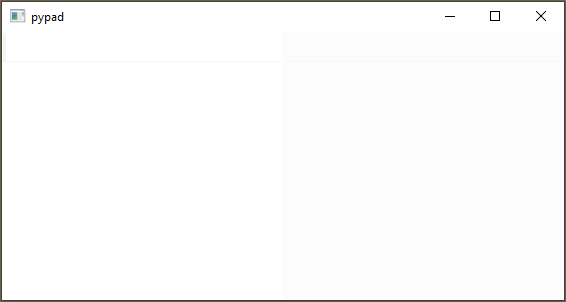

<h1 align="center">
   PyPad - Python Notepad
</h1>


Python as a calculator, notepad style.  

Inspired by notepad calculators ([Soulver](https://soulver.app/), [Numi](https://numi.app/), [Numbr](https://numbr.dev/)), reactive jupyter notebooks ([marimo](https://github.com/marimo-team/marimo), [ipyflow](https://github.com/ipyflow)) and similar projects ([Hydrogen](https://github.com/nteract/hydrogen)).  

Based on [qtconsole](https://github.com/jupyter/qtconsole).

## Usage
```
pypad
```

<p align="center">
  <picture>
    <source media="(prefers-color-scheme: dark)" srcset="docs/pypad1.gif">
    <source media="(prefers-color-scheme: light)" srcset="docs/pypad1.gif">
    
  </picture>
</p>

## Installation 
```
pip install git+https://github.com/idanpa/pypad
```
