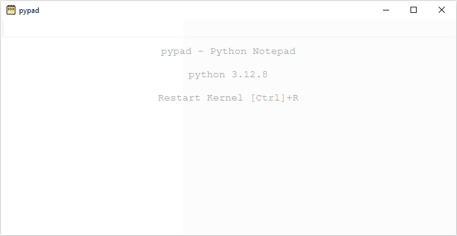

# PyPad - Python Notepad

Inspired by notepad calculators (e.g. [Soulver](https://soulver.app/), [Numbr](https://numbr.dev/))

## Usage
```
pypad
```

<p align="center">
  <picture>
    <source media="(prefers-color-scheme: dark)" srcset="docs/pypad1.gif">
    <source media="(prefers-color-scheme: light)" srcset="docs/pypad1.gif">
    
  </picture>
</p>

## Installation 
```
pip install git+https://github.com/idanpa/pypad
```
